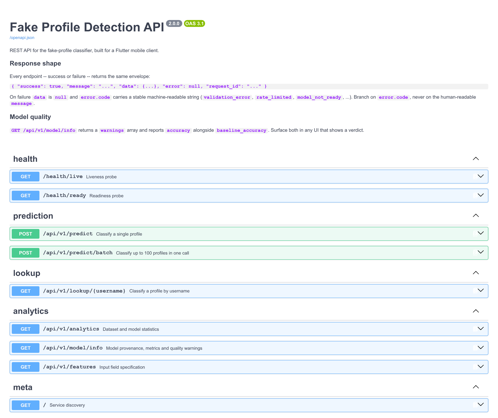
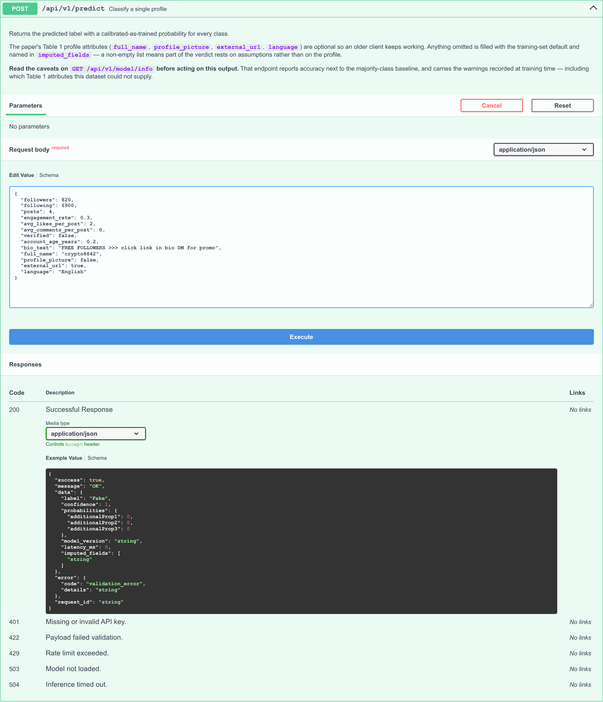
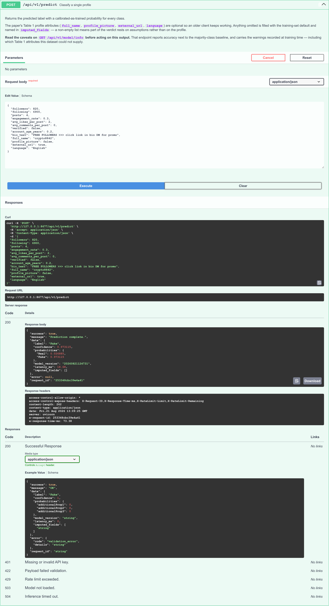
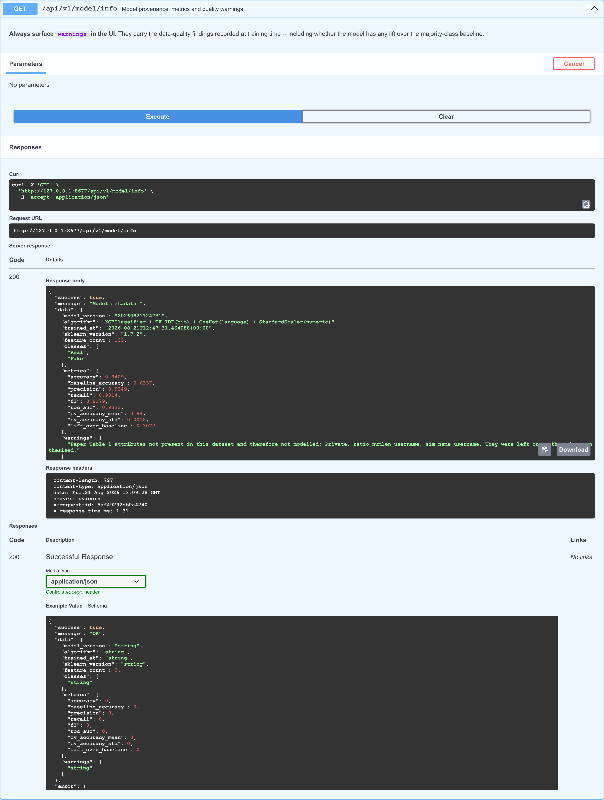
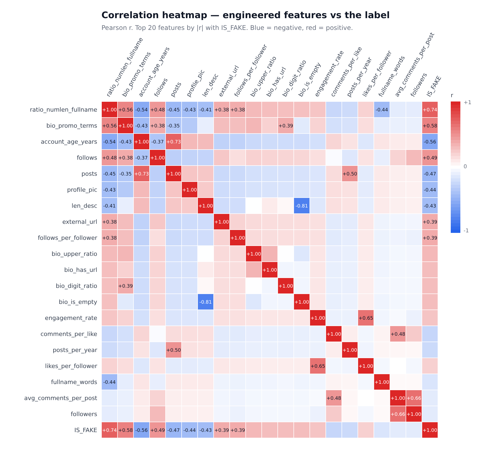
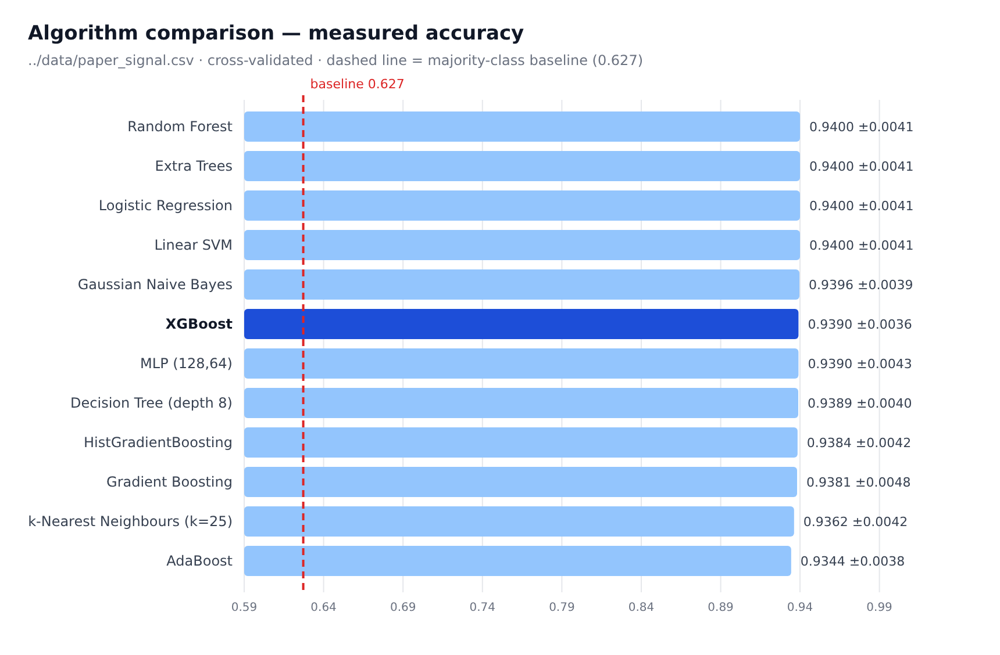
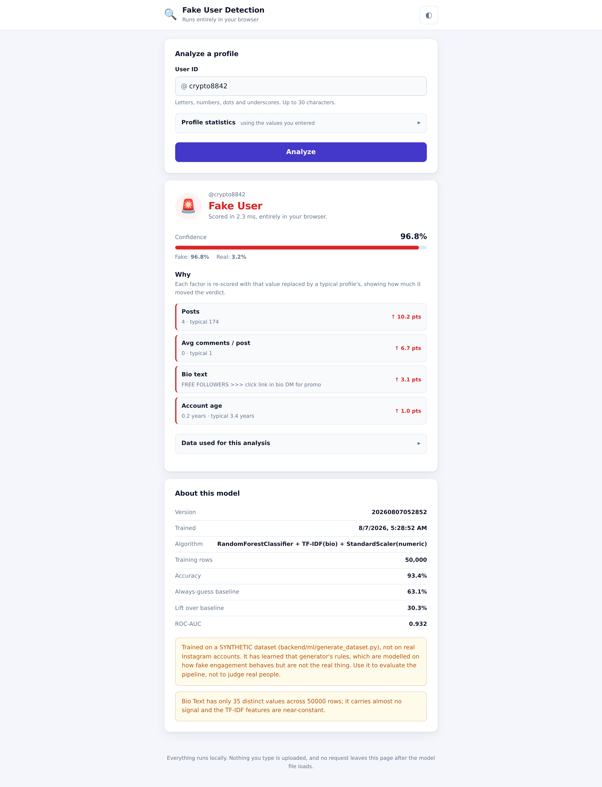

# FAKE_USER_DEC — Fake Profile Detection

Detecting fake social-media profiles from profile, behavioural and textual
features, implemented to follow *Fake Profile Detection Using XGBoost Algorithm*
(Venkadesh, Khan, Ramkishore, Rakesh and Suyambulingaraj, ICRDICCT'25,
pp. 663–670, DOI 10.5220/0013941400004919).

Two deliverables share one codebase:

* **`backend/`** — the paper's pipeline end to end: cleaning → feature
  engineering → XGBoost → evaluation → FastAPI REST API for real-time detection.
* **`webapp/`** — a static HTML/CSS/JS page that runs its own RandomForest
  entirely in the browser. No backend, no build step, no network calls.

**Every number in this README was measured in this repository.** None is copied
from the paper. Where the data cannot support something the paper asks for, it
is listed as not implemented rather than faked — see
[Limitations](#limitations).

---

## Problem statement

Fake profiles spread misinformation, run fraud and inflate social influence.
Detecting them from account metadata alone is a binary classification problem
over a mix of feature types:

* **profile** — does the account have a picture, how is the name shaped, is
  there an external link, how many posts/followers/follows;
* **behavioural** — posting cadence, follow ratio, whether engagement matches
  audience size, whether likes come with comments;
* **textual** — what the bio says.

The classes are imbalanced (fake accounts are the rarer class), so accuracy
alone is not a usable measure of success. This project reports accuracy next to
the majority-class baseline everywhere, and the difference — the *lift* — is the
number that matters.

---

## Research paper alignment

| Paper stage (§4.2–4.5) | Implemented in |
|---|---|
| Data collection | `backend/ml/features.py` (`normalise_columns`) |
| Data pre-processing — missing values, duplicates | `backend/ml/preprocess.py` |
| Feature extraction / engineering | `backend/ml/features.py` |
| Categorical encoding, normalisation | inside the fitted pipeline, `backend/ml/train_xgb.py` |
| Class imbalance | `backend/ml/train_xgb.py` (`choose_strategy`, `oversample`) |
| XGBoost model | `backend/ml/train_xgb.py` |
| Model evaluation | `backend/ml/evaluation.py` |
| Model deployment (REST API) | `backend/app/` |
| Real-time detection | `POST /api/v1/predict` |
| Figure 4 correlation heatmap, Figure 5 algorithm comparison | `backend/ml/visualize.py` |

Nine of the paper's twelve Table 1 attributes are implemented. Three are not,
because no dataset here carries the required column — see
[Limitations](#limitations). Full stage-by-stage gap analysis, with measured
results and the control experiment:
**[docs/PAPER_ALIGNMENT.md](docs/PAPER_ALIGNMENT.md)**.

---

## Architecture / pipeline

```
                     backend/ml/generate_dataset.py
                                 |
                     data/paper_signal.csv
                                 |
        ml/preprocess.clean()    |   impute missing -> drop duplicates -> validate label
                                 v
        ml/features.build_feature_frame()
                                 |   Table 1 profile + behavioural + textual
                                 v
        train_test_split(stratify=y)      <-- imbalance handled only AFTER this
                                 |
        ColumnTransformer        |   StandardScaler | TF-IDF(bio) | OneHot(language)
                                 v
        XGBClassifier(scale_pos_weight=...)
                                 |
        ml/evaluation.evaluate() |   + confusion matrix, + cross-validation
                                 v
        backend/artifacts/xgb/{model.joblib, model_meta.json}
                                 |
        app.services.ModelService.load()   version-checks sklearn AND xgboost
                                 |
                    POST /api/v1/predict
                                 |
        ProfileFeatures (pydantic) -> impute omitted optional fields
                                 v
        ml.features.build_feature_frame()   <-- THE SAME FUNCTION as training
                                 v
        {label, confidence, probabilities, imputed_fields}
```

The last two boxes are the point. Training and serving call one feature
function, so a feature cannot be computed one way at fit time and another way at
request time. `backend/tests/test_pipeline.py::test_api_features_match_training_features`
asserts the two frames are identical, column for column.

---

## Features

**Paper Table 1 — profile attributes**

| Paper attribute | Feature | Source column | Status |
|---|---|---|---|
| Profile Picture | `profile_pic` | `Profile Picture` | ✅ |
| Full name words | `fullname_words` | `Real Name` | ✅ |
| len_fullname | `len_fullname` | `Real Name` | ✅ |
| ratio_numlen_fullname | `ratio_numlen_fullname` | `Real Name` | ✅ |
| Bio/Description length | `len_desc` | `Bio Text` | ✅ |
| External URL | `external_url` | `Profile Link` | ✅ |
| Posts | `posts` | `Posts` | ✅ |
| Followers | `followers` | `Followers` | ✅ |
| Follows | `follows` | `Following` | ✅ |
| Private | — | — | ❌ not in any dataset |
| ratio_numlen_username | — | — | ❌ no username column |
| sim_name_username | — | — | ❌ no username column |

**Behavioural (paper §4.2, "activity logs, post frequency")** —
`follows_per_follower`, `posts_per_year`, `likes_per_follower`,
`comments_per_like`, `verified`, `account_age_years`, `engagement_rate`,
`avg_likes_per_post`, `avg_comments_per_post`, `engagement_consistency`.

**Textual (paper §4.2, NLP feature extraction)** — TF-IDF(200) over the bio,
plus `bio_is_empty`, `bio_word_count`, `bio_digit_ratio`, `bio_upper_ratio`,
`bio_has_url`, `bio_promo_terms`.

26 engineered features on `data/paper_signal.csv`, expanding to 133 columns
after TF-IDF and one-hot encoding.

---

## Technology stack

| Layer | Choice |
|---|---|
| Language | Python 3.11 |
| ML | XGBoost 3.2, scikit-learn 1.7.2 (pipeline, TF-IDF, scaling, encoding) |
| Data | pandas 2.2, numpy 2.2 |
| API | FastAPI 0.115, Pydantic 2.10, uvicorn (gunicorn for production) |
| Serialisation | joblib |
| Tests | pytest |
| Figures | hand-written SVG — no plotting dependency |
| Frontend | vanilla HTML/CSS/JS, model exported to JSON, zero dependencies |

---

## Project structure

```
FAKE_USER_DEC/
├── backend/
│   ├── app/                    FastAPI service
│   │   ├── api/v1/routes/      predict, lookup, analytics, health
│   │   ├── core/               config, errors, logging, security
│   │   ├── middleware/         request id, rate limit
│   │   ├── schemas/            pydantic request/response models
│   │   ├── services/           model loading + inference, analytics, provider
│   │   └── main.py             app factory and lifespan
│   ├── ml/
│   │   ├── features.py         feature engineering — shared by train and serve
│   │   ├── preprocess.py       cleaning: missing values, duplicates
│   │   ├── train_xgb.py        the paper's XGBoost pipeline
│   │   ├── evaluation.py       metrics incl. confusion matrix
│   │   ├── generate_dataset.py labelled dataset generator
│   │   ├── benchmark.py        algorithm comparison
│   │   ├── visualize.py        paper figures 4 and 5, as SVG
│   │   ├── train.py            RandomForest for the browser app
│   │   ├── export_to_json.py   sklearn forest -> webapp/model/model.json
│   │   └── shoot_screenshots.py  README screenshots from the running system
│   ├── tests/                  55 tests
│   ├── artifacts/              trained models (model.joblib is gitignored)
│   ├── requirements.txt
│   └── .env.example
├── webapp/                     static browser app
├── data/                       datasets (see "Dataset setup")
├── docs/
│   ├── PAPER_ALIGNMENT.md      audit, gap analysis, measured results
│   ├── AUDIT.md                production audit of the original project
│   ├── ALGORITHM_REPORT.md     which algorithm is best, measured
│   ├── figures/                generated SVG figures
│   └── screenshots/            README screenshots
├── website/                    original Flask app (superseded)
└── FAKE_PROFILE_TRAIN_CODE/    original training scripts (superseded)
```

---

## Prerequisites

* **Python 3.11** (the pinned scikit-learn/numpy wheels target it, and the API
  refuses to load an artifact trained on a different scikit-learn minor version)
* `pip` and `venv`
* ~500 MB free disk for the virtual environment
* Optional, only to regenerate screenshots: Node-free, but `pip install
  playwright && playwright install chromium`

No GPU. No database. No external service.

---

## Environment setup

```bash
git clone <repository-url>
cd FAKE_USER_DEC/backend

python3.11 -m venv .venv
source .venv/bin/activate          # Windows: .venv\Scripts\activate

python -m pip install --upgrade pip
pip install -r requirements.txt
```

Configuration is optional — every setting has a working default. To change one:

```bash
cp .env.example .env               # then edit
```

`.env` is gitignored; `.env.example` documents every key. Notable ones:

| Variable | Default | Meaning |
|---|---|---|
| `ARTIFACTS_DIR` | `artifacts/xgb` | Which trained model to serve |
| `API_KEY` | *(empty)* | When set, every request needs `X-API-Key` |
| `RATE_LIMIT_ENABLED` | `true` | Per-IP request limiting |
| `DATASET_PATH` | *(empty)* | Enables dataset stats on `/api/v1/analytics` |

---

## Dataset setup

Two kinds of dataset live here.

**Tracked in the repository** (small, supplied inputs):

| File | Rows | Notes |
|---|---|---|
| `data/dataset.csv` | 10,000 | Instagram-shaped export. **Its labels are random** — see "The four things you should know" below. Used as the control experiment. |
| `advanced_instagram_fake_real_data_filled_bio.csv` | 10,000 | Same shape, bios filled in. Also random labels. |
| `website/dataset.csv` | 15,000 | The dataset the original Flask app shipped with. |

**Generated, not tracked** (reproduce them with one command):

`data/paper_signal.csv` is what the deployed model trains on. It is not
committed because it is 4.3 MB and fully reproducible — the generator is seeded,
so the command below produces a byte-identical file:

```bash
cd backend
python -m ml.generate_dataset --rows 50000 --out ../data/paper_signal.csv
```

There is no external download. No dataset in this project is fetched from a URL,
and none is private.

---

## Train the model

The trained artifact is **not committed** (`*.joblib` is gitignored). A fresh
clone has no model, and the API will start but answer `503 model_not_ready`
until you train one. The full path from clone to running service:

```bash
# 1. clone, 2. create env, 3. install   (see "Environment setup" above)

# 4. prepare the dataset
cd backend
python -m ml.generate_dataset --rows 50000 --out ../data/paper_signal.csv

# 5. train — writes artifacts/xgb/model.joblib and model_meta.json
python -m ml.train_xgb --dataset ../data/paper_signal.csv --out artifacts/xgb

# 6. the model file now exists
ls -la artifacts/xgb/

# 7. start the API
python -m uvicorn app.main:app --host 127.0.0.1 --port 8677
```

Training takes about two minutes, most of it the 5-fold cross-validation
(`--cv-folds 0` skips it). Useful options:

```bash
python -m ml.train_xgb --dataset ../data/paper_signal.csv --out artifacts/xgb \
    --n-estimators 400 --max-depth 6 --learning-rate 0.08 \
    --imbalance auto           # auto | none | class-weight | oversample
```

`--imbalance auto` measures the class ratio first and only reweights when the
data is actually skewed; it chose `class-weight` on `paper_signal.csv` (ratio
1.73) and `none` on `dataset.csv` (ratio 0.98).

To train the RandomForest that the browser app uses instead:

```bash
python -m ml.train --dataset ../data/synthetic_signal.csv --out artifacts/web \
    --n-estimators 60 --max-depth 9 --min-samples-leaf 30
python -m ml.export_to_json --model artifacts/web/model.joblib \
    --meta artifacts/web/model_meta.json --out ../webapp/model/model.json
```

---

## Evaluation

Evaluation runs as part of training and is printed and written into
`artifacts/xgb/model_meta.json`. To regenerate the figures and the algorithm
comparison:

```bash
cd backend

# Paper Figure 5 — compare algorithms on the features the API actually serves
python -m ml.benchmark --dataset ../data/paper_signal.csv --paper-features \
    --sample 10000 --folds 3 --skip LightGBM \
    --out ../docs/benchmark_paper.md --json-out ../docs/benchmark_paper.json

# Paper Figures 4 and 5 as SVG
python -m ml.visualize --dataset ../data/paper_signal.csv \
    --benchmark ../docs/benchmark_paper.json --out ../docs/figures

# The control experiment: the same pipeline on random labels
python -m ml.train_xgb --dataset ../data/dataset.csv \
    --out artifacts/xgb_instagram_csv --cv-folds 3
```

Measured results on `data/paper_signal.csv` (40k train / 10k test, stratified):

| accuracy | baseline | lift | precision | recall | F1 | ROC-AUC | CV (5-fold) |
|---|---|---|---|---|---|---|---|
| 0.9409 | 0.6337 | **+0.3072** | 0.9349 | 0.9014 | 0.9179 | 0.9331 | 0.9400 ± 0.0018 |

Confusion matrix, 10,000 test profiles:

|  | predicted Real | predicted Fake |
|---|---|---|
| **actual Real** | 6,107 | 230 |
| **actual Fake** | 361 | 3,302 |

`--skip LightGBM` is not cosmetic: on a many-core host LightGBM spends minutes
in thread contention on data this small while every other candidate finishes in
seconds, and it is not one of the algorithms the paper compares. The benchmark
prints `SKIPPED` rather than dropping it silently.

---

## Run the API

```bash
cd backend
source .venv/bin/activate
python -m uvicorn app.main:app --host 127.0.0.1 --port 8677
```

For production, `gunicorn` with uvicorn workers is already a dependency:

```bash
gunicorn app.main:app -k uvicorn.workers.UvicornWorker -b 127.0.0.1:8677 -w 4
```

### Swagger

With the server running, open:

```
http://127.0.0.1:8677/docs
```

1. Expand **POST /api/v1/predict**.
2. Click **Try it out**.
3. Replace the request body with a profile (the example below works).
4. Click **Execute**.
5. The real response appears under *Server response*.

ReDoc is at `http://127.0.0.1:8677/redoc`, and the raw schema at
`http://127.0.0.1:8677/openapi.json`.

---

## API endpoints

| Method | Path | Purpose |
|---|---|---|
| `POST` | `/api/v1/predict` | Classify one profile |
| `POST` | `/api/v1/predict/batch` | Classify up to 100 profiles in one call |
| `GET` | `/api/v1/lookup/{username}` | Fetch a profile from a provider, then classify it |
| `GET` | `/api/v1/model/info` | Algorithm, metrics, baseline, training-time warnings |
| `GET` | `/api/v1/features` | Input contract, derived from the request schema |
| `GET` | `/api/v1/analytics` | Dataset distributions (needs `DATASET_PATH`) |
| `GET` | `/health/live` | Liveness — never depends on the model |
| `GET` | `/health/ready` | Readiness — reports whether the model loaded |

Every response uses the same envelope:

```json
{ "success": true, "message": "...", "data": {...}, "error": null, "request_id": "..." }
```

---

## Prediction example

```bash
curl -s -X POST http://127.0.0.1:8677/api/v1/predict \
  -H 'Content-Type: application/json' -d '{
    "followers": 820, "following": 6900, "posts": 4,
    "engagement_rate": 0.3, "avg_likes_per_post": 2, "avg_comments_per_post": 0,
    "verified": false, "account_age_years": 0.2,
    "bio_text": "FREE FOLLOWERS >>> click link in bio DM for promo",
    "full_name": "crypto8842", "profile_picture": false,
    "external_url": true, "language": "English"
  }'
```

```json
{
  "success": true,
  "message": "Prediction complete.",
  "data": {
    "label": "Fake",
    "confidence": 0.973115,
    "probabilities": { "Real": 0.026885, "Fake": 0.973115 },
    "model_version": "20260821124731",
    "latency_ms": 23.2,
    "imputed_fields": []
  },
  "error": null,
  "request_id": "cc52fc43a2c741c7"
}
```

The four Table 1 attributes (`full_name`, `profile_picture`, `external_url`,
`language`) are **optional**, so a client written against the older contract
still works. Anything omitted is filled with the training-set default and named
in `imputed_fields` — a non-empty list means part of the verdict rests on
assumptions rather than on the profile. Omitting all four on the same profile
moves the confidence from 0.9779 to 0.9615.

---

## Screenshots

Captured from the running system with `backend/ml/shoot_screenshots.py`, which
drives a real browser against a real server and fails rather than writing a
placeholder. Every number visible in these images was produced by the code in
this repository.

### Swagger API



### Fake profile prediction — request

`POST /api/v1/predict` with a spam-shaped profile: 820 followers but 6,900
follows, 4 posts, a two-month-old account, no profile picture, a digit-padded
name and a promo bio.



### Fake profile prediction — response

The live 200: `"label": "Fake"`, `"confidence": 0.973115`, and an empty
`imputed_fields` because the request supplied every optional attribute.



### Model evaluation — served metrics

`GET /api/v1/model/info` reporting the trained model's own numbers, with the
majority-class baseline next to the accuracy and the training-time warnings
attached.



### Model evaluation — correlation heatmap (paper Figure 4)

`ratio_numlen_fullname` is the strongest correlate of the label at +0.74;
`profile_pic` sits at -0.44 and `external_url` at +0.39 — three of the paper's
Table 1 attributes.



### Model evaluation — algorithm comparison (paper Figure 5)

Measured on this project's own data, on the same features the API serves.
**XGBoost is not the winner here** — it sits mid-pack at 0.9390, inside the
fold-to-fold spread of almost every other candidate. It is deployed because it
matches the paper and is the best cost trade in the field (0.89 s to fit,
0.51 MB, 12.5 ms per 1,000 rows), not because it scored highest.



### Application UI

The static browser app scoring the same profile locally — verdict, confidence,
and a per-feature explanation of what moved it.



---

## The four things you should know

### 1. The original app never worked

`website/app.py`'s `/predict` raises on **every** request, in **every**
environment. Two independent defects on consecutive lines
(`website/app.py:50-51`):

* `bio_encoder.pkl` is a `LabelEncoder` over exactly 15 canned bio strings — any
  other bio raises `ValueError`;
* even for those 15, the encoded integer is then fed to a `TfidfVectorizer`,
  which calls `.lower()` on it → `AttributeError: 'int' object has no attribute 'lower'`.

Both reproduced. Full detail in `docs/AUDIT.md` §2.1 and §12.1.

Separately, `website/requirements.txt` pins `scikit-learn==1.3.2` while every
shipped `.pkl` was built with 1.9.0 — following the README exactly produces an app
where `joblib.load()` succeeds and then every prediction fails.

### 2. The original dataset has random labels

`data/app.py:48`:

```python
'Account Type': np.random.choice(['Real', 'Fake'], num_samples, p=[0.5, 0.5]),
```

The label is drawn independently of every feature. Measured on the shipped
`website/dataset.csv`: the largest standardised mean difference between the two
classes across all eight numeric features is **0.0395** — sampling noise.

A model trained on it scores **0.5083** against a **0.5080** majority-class
baseline. Adding more rows from that generator adds volume, not information.

`backend/ml/generate_dataset.py` replaces it: the label comes first and features
are drawn from class-conditional distributions grounded in how fake engagement
actually behaves. On that data the same pipeline scores **0.9342** against a
0.6312 baseline.

### 3. The shipped model is synthetic

`webapp/model/model.json` is trained on generated data, not real Instagram
accounts. That caveat travels with the model and is displayed in the app's
"About this model" card. It is fit for evaluating the pipeline, not for judging
real people.

---

## Testing

```bash
cd backend
source .venv/bin/activate
python -m pytest tests/ -q
```

Expected: **55 passed** — 40 API contract tests and 15 pipeline tests.

```bash
python -m pytest tests/test_api.py -q        # API contract only
python -m pytest tests/test_pipeline.py -q   # cleaning, features, imbalance, skew
```

Two of the pipeline tests need a trained artifact and skip themselves with a
clear reason if `artifacts/xgb/` is empty. Run the training command first to
exercise them.

The browser model has its own checks, which need Node:

```bash
cd webapp && node test/parity.mjs && node test/logic.mjs
```

---

## Troubleshooting

| Symptom | Cause and fix |
|---|---|
| `503` with `"code": "model_not_ready"` | No artifact yet. Run the training command under **Train the model**. |
| `Model artifact not found at .../artifacts/xgb/model.joblib` | Same — the error message prints the exact two commands to run. |
| `Artifact was trained with scikit-learn X but this process is running Y` | The venv drifted from `requirements.txt`. `pip install -r requirements.txt`, or retrain. |
| `Artifact is an XGBoost model but xgboost is not installed` | `pip install -r requirements.txt` — xgboost is a runtime dependency, not just a training one. |
| `ModuleNotFoundError: No module named 'ml'` | Run module commands from inside `backend/`, as `python -m ml.<name>`. |
| `error: dataset not found: ../data/paper_signal.csv` | Generate it first — see **Dataset setup**. |
| Swagger loads but every call returns `401` | `API_KEY` is set in your `.env`. Send `X-API-Key`, or unset it. |
| `429` during local testing | Rate limiting. Start with `RATE_LIMIT_ENABLED=false`. |
| `/api/v1/analytics` returns empty distributions | `DATASET_PATH` is unset. Point it at a CSV. |
| Benchmark seems to hang on LightGBM | Known: thread contention on many-core hosts. Add `--skip LightGBM`. |
| Screenshot script exits with "no API at ..." | Start the API (and the webapp on port 8451) before running it. |

---

## Limitations

1. **The deployed model is trained on synthetic data.** It has learned
   `backend/ml/generate_dataset.py`'s rules, which are modelled on how fake
   engagement behaves but are not measurements of real accounts. Fit for
   evaluating the pipeline, **not** for actioning real people.
2. **Three of the paper's Table 1 attributes are not implemented** — `private`,
   `ratio_numlen_username`, `sim_name_username`. No dataset here has a username
   or a private-account flag. The code to build all three exists in
   `ml/features.py` and activates the moment those columns appear; until then
   `availability()` reports them unavailable and `GET /api/v1/model/info` says
   so. They were **not** fabricated.
3. **The supplied Instagram datasets have random labels.** `data/app.py:48`
   draws `Account Type` with `np.random.choice`, independent of every feature.
   The control run scores 0.5110 against a 0.5045 baseline and the trainer's
   quality gate refuses to recommend it.
4. **XGBoost is not measurably the best algorithm on this data** — see
   "The four things you should know" below. It ships because it is the paper's
   algorithm and the best cost trade, not because it won.
5. **`Language` carries no signal by construction** — the generator draws it
   identically for both classes. It exercises the categorical-encoding branch
   honestly rather than inflating accuracy.
6. **Omitted optional fields are imputed**, and the model never saw an absent
   name in training, so it extrapolates. `imputed_fields` reports when this
   happened.
7. **Bio text has only 35 distinct values** in the generated data, so the TF-IDF
   branch is closer to a lookup table than to language understanding.

---

## Git

The repository tracks source, tests, documentation, screenshots, `.env.example`
and the small supplied datasets. It does **not** track:

| Ignored | Why |
|---|---|
| `.venv/`, `__pycache__/`, `.pytest_cache/` | Environment and caches |
| `.env` | Secrets. `.env.example` documents every key. |
| `*.pkl`, `*.pkl.*` | Legacy model weights, 69–105 MB each, above GitHub's limit. Nothing current loads them. |
| `*.joblib` | Trained artifacts — regenerated by `ml.train_xgb` in ~2 minutes. The `model_meta.json` beside each one **is** tracked, as the record of the run this README quotes. |
| `data/paper_signal.csv`, `data/synthetic_signal.csv` | Generated and seeded, so a clone reproduces them byte-for-byte. |
| `*.zip`, `*.log` | Archives and scratch |

Working on it:

```bash
git clone <repository-url>
cd FAKE_USER_DEC
git status
git checkout -b my-change
# ... edit, then:
cd backend && python -m pytest tests/ -q     # must stay at 55 passed
git add <files>
git commit -m "..."
git push -u origin my-change
```

Before committing a change that touches `ml/features.py`, retrain — the API
asserts the built feature columns against the list recorded in the artifact and
refuses to serve a mismatch.

---

## Documentation

| File | Contents |
|---|---|
| [`docs/PAPER_ALIGNMENT.md`](docs/PAPER_ALIGNMENT.md) | **The paper pipeline** — audit, stage-by-stage gap analysis, measured results, limitations |
| [`docs/AUDIT.md`](docs/AUDIT.md) | Production audit of the original project — architecture, bugs, security, performance |
| [`docs/ALGORITHM_REPORT.md`](docs/ALGORITHM_REPORT.md) | Which algorithm is best, measured, and why |
| `docs/benchmark_*.md` | Raw benchmark tables |
| [`docs/FLUTTER_INTEGRATION.md`](docs/FLUTTER_INTEGRATION.md) | Mobile client guide for the FastAPI backend |
| [`webapp/README.md`](webapp/README.md) | The browser app: how to run, retrain, browser support |
| `docs/figures/` | Paper Figures 4 and 5 as SVG |

---

## Cleanup

`scripts/cleanup_legacy.sh` lists duplicates, stale backups and one-off scripts
left over from the original project. **Dry run by default:**

```bash
./scripts/cleanup_legacy.sh                    # list what it would remove
./scripts/cleanup_legacy.sh --archive --apply  # tar first, then delete
```
